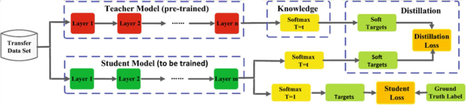
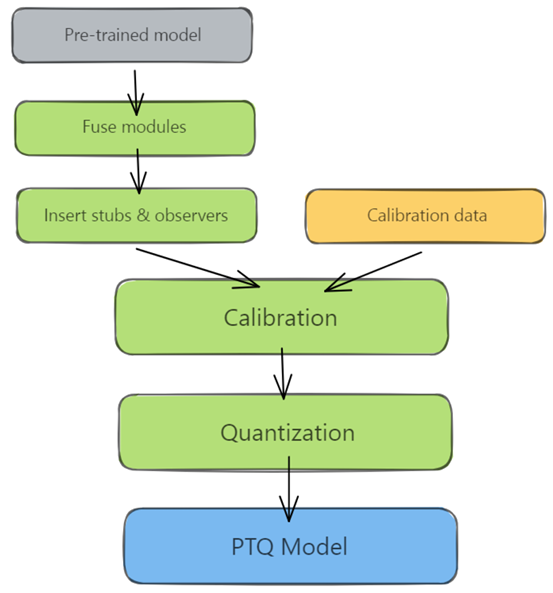
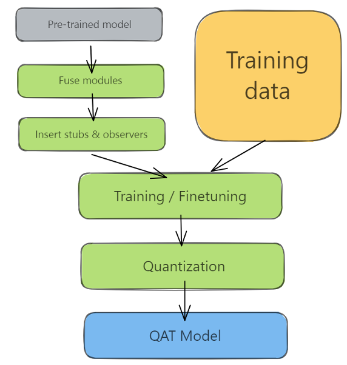

# Model-Compression-Technique
**Pruning**
- Method: Nework Slimimg Pruning 
- Model: ResNet50
 
 

**Knowlwdge Distillation**
- Teacher Model: ResNet38
- Student Model: ResNet18
- Dataset: cifar10
- Parameter: 21.3M(teacher) → 11.2M(student)
- Accuracy: 87.11%(teacher) → 87.77%(student)

**Quantize**
- Post Training Quantization (PTQ)
  
  
  
- Quantization-Aware Training (QAT)
  
  
